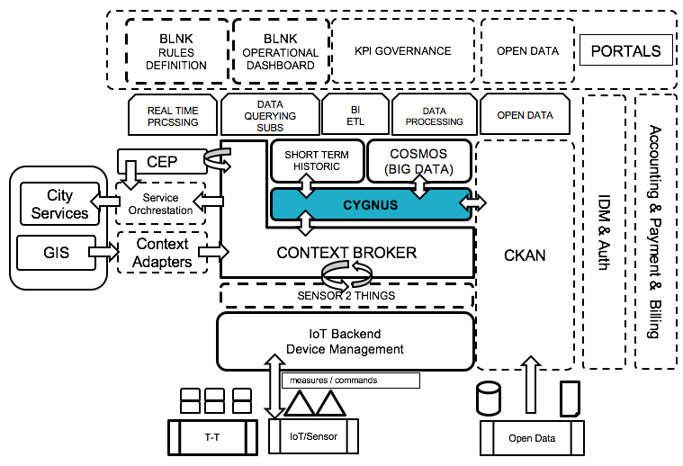

# Cygnus

 

Cygnus is a connector in charge of persisting context data sources into other third-party databases and storage systems, creating a historical view of the context. Internally, Cygnus is based on [Apache Flume](http://flume.apache.org/), Flume is a data flow system based on the concepts of flow-based programming. It supports powerful and scalable directed graphs of data routing, transformation, and system mediation logic. It was built to automate the flow of data between systems. While the term 'dataflow' can be used in a variety of contexts, we use it here to mean the automated and managed flow of information between systems.

Each data persistence agent within Cygnus is composed of three parts - a listener or source in charge of receiving the data, a channel where the source puts the data once it has been transformed into a Flume event, and a sink, which takes Flume events from the channel in order to persist the data within its body into a third-party storage.

This project is part of [FIWARE](https://www.fiware.org/). For more information
check the FIWARE Catalogue entry for the
[Core Context Management](https://github.com/Fiware/catalogue/tree/master/core).

| :books: [Documentation](https://fiware-cygnus.rtfd.io)  | :mortar_board: [Academy](https://fiware-academy.readthedocs.io/en/latest/core/cygnus) | :whale: [Docker Hub](https://hub.docker.com/r/fiware/cygnus-ngsi/) |
|---|---|---|

## Contents

-   [Background](#background)
-   [Roadmap](#roadmap)
-   [Further Documentation](#further-documentation)
-   [License](#license)

# Background

Internally, Cygnus is based on [Apache Flume](http://flume.apache.org/), a technology addressing the design and execution of data collection and persistence <i>agents</i>. An agent is basically composed of a listener or source in charge of receiving the data, a channel where the source puts the data once it has been transformed into a Flume event, and a sink, which takes Flume events from the channel in order to persist the data within its body into a third-party storage.

Cygnus is designed to run a specific Flume agent per source of data.

Current stable release is able to persist the following sources of data in the following third-party storages:

* NGSI-like context data in:
    * [HDFS](http://hadoop.apache.org/docs/current/hadoop-project-dist/hadoop-hdfs/HdfsUserGuide.html), the [Hadoop](http://hadoop.apache.org/) distributed file system.
    * [MySQL](https://www.mysql.com/), the well-known relational database manager.
    * [CKAN](http://ckan.org/), an Open Data platform.
    * [MongoDB](https://www.mongodb.org/), the NoSQL document-oriented database.
    * [STH Comet](https://github.com/telefonicaid/fiware-sth-comet), a Short-Term Historic database built on top of MongoDB.
    * [Kafka](http://kafka.apache.org/), the publish-subscribe messaging broker.
    * [DynamoDB](https://aws.amazon.com/dynamodb/), a cloud-based NoSQL database by [Amazon Web Services](https://aws.amazon.com/).
    * [PostgreSQL](http://www.postgresql.org/), the well-known relational database manager.
    * [Carto](https://carto.com/), the database specialized in geolocated data.
    * [PostGIS](http://postgis.net/), a spatial database extender for PostgreSQL object-relational database.
    * [Orion](https://github.com/telefonicaid/fiware-orion), the FIWARE Context Broker.
    * [Elasticsearch](https://www.elastic.co/products/elasticsearch), the distributed full-text search engine with JSON documents.
* Twitter data in:
    * [HDFS](http://hadoop.apache.org/docs/current/hadoop-project-dist/hadoop-hdfs/HdfsUserGuide.html), the [Hadoop](http://hadoop.apache.org/) distributed file system.

**IMPORTANT NOTE**: for the time being, `cygnus-ngsi` and `cygnus-twitter` agents cannot be installed in the same base path, because of an incompatibility with the required version of the `httpclient` library. Of course, if you are going to use just one of the agents, there is no problem at all.

cygnus-ngsi:  
cygus-twitter : 

## Cygnus place in FIWARE architecture
Cygnus (more specifically, cygnus-ngsi agent) plays the role of a connector between Orion Context Broker (which is a NGSI source of data) and many FIWARE storages such as CKAN, Cosmos Big Data (Hadoop) and STH Comet. Of course, as previously said, you may add MySQL, Kafka, Carto, etc as other non FIWARE storages to the FIWARE architecture.

## Roadmap

The roadmap of this FIWARE GE is described [here](doc/roadmap.md).

## Further documentation
The per agent **Quick Start Guide** found at readthedocs.org provides a good documentation summary ([cygnus-ngsi](http://fiware-cygnus.readthedocs.io/en/latest/cygnus-ngsi/quick_start_guide/index.html), [cygnus-twitter](http://fiware-cygnus.readthedocs.io/en/latest/cygnus-twitter/quick_start_guide/index.html)).

Nevertheless, both the **Installation and Administration Guide** and the **User and Programmer Guide** for each agent also found at [readthedocs.org](http://fiware-cygnus.readthedocs.io/en/latest/) cover more advanced topics.

The per agent **Flume Extensions Catalogue** completes the available documentation for Cygnus ([cygnus-ngsi](http://fiware-cygnus.readthedocs.io/en/latest/cygnus-ngsi/flume_extensions_catalogue/introduction/index.html), [cygnus-twitter](http://fiware-cygnus.readthedocs.io/en/latest/cygnus-twitter/flume_extensions_catalogue/introduction/index.html)).

Other interesting links are:

* Our [Apiary Documentation](http://telefonicaid.github.io/fiware-cygnus/api/latest) if you want to know how to use our API methods for Cygnus.
* [cygnus-ngsi](doc/cygnus-ngsi/integration) **integration** examples .
* [cygnus-ngsi](https://edu.fiware.org/mod/resource/view.php?id=1037) **introductory course** in FIWARE Academy.
* The [Contributing Guidelines](doc/contributing/contributing_guidelines.md) if your aim is to extend Cygnus.

### Reporting issues and contact information
Any doubt you may have, please refer to the [Cygnus Core Team](./reporting_issues_and_contact.md).

---

## Licence

Cygnus is licensed under Affero General Public License (GPL)
version 3. You can find a [copy of this license in the repository](./LICENSE).

© 2019 Telefonica Investigación y Desarrollo, S.A.U

### Are there any legal issues with AGPL 3.0? Is it safe for me to use?

There is absolutely no problem in using a product licensed under AGPL 3.0. Issues with GPL 
(or AGPL) licenses are mostly related with the fact that different people assign different 
interpretations on the meaning of the term “derivate work” used in these licenses. Due to this,
some people believe that there is a risk in just _using_ software under GPL or AGPL licenses
(even without _modifying_ it).

For the avoidance of doubt, the owners of this software licensed under an AGPL 3.0 license  
wish to make a clarifying public statement as follows:

> Please note that software derived as a result of modifying the source code of this
> software in order to fix a bug or incorporate enhancements is considered a derivative 
> work of the product. Software that merely uses or aggregates (i.e. links to) an otherwise 
> unmodified version of existing software is not considered a derivative work, and therefore
> it does not need to be released as under the same license, or even released as open source.
