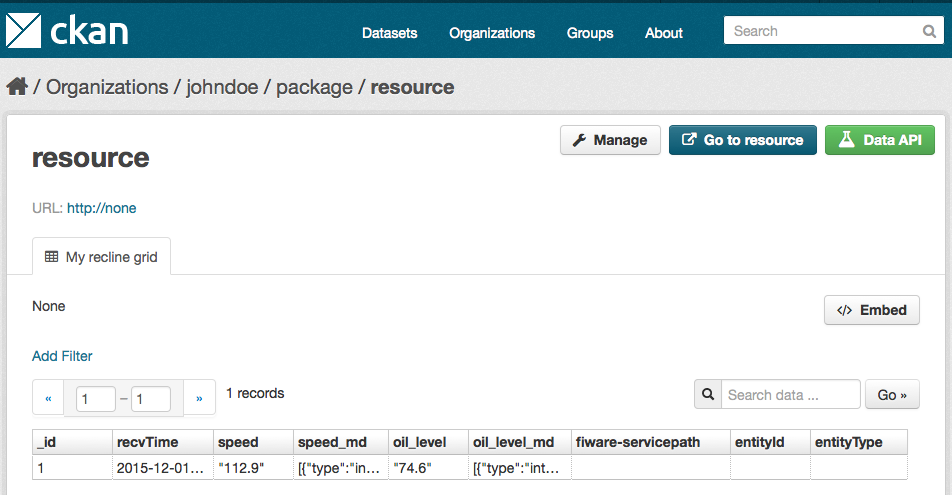

#<a name="top"></a>Cygnus translators

Content:

* [`cygnus_translator_0.1_to_0.2.sh`](#section1)
* [`cygnus_translator_0.1_to_0.3.sh`](#section2)
* [`cygnus_translator_0.2_to_0.3.sh`](#section3)
* [`cygnus_translator_pre0.10.0_to_0.10.0_hdfs.sh`](#section4)
* [`cygnus_translator_pre0.10.0_to_0.10.0_mysql.sh`](#section5)
* [`cygnus_translator_pre0.10.0_to_0.10.0_ckan.py`](#section6)
* [Reporting issues and contact information](#section7)

##<a name="section1"></a>`cygnus_translator_0.1_to_0.2.sh`
Input parameters:

* `hdfsUser`: HDFS username owning the files to be translated.
* `srcHDFSFolder`: absolute HDFS path to the folder containing the 0.1-like files to be translated.
* `dstHDFSFolder`: absolute HDFS path to the folder that will contain the 0.2-like files to be translated.

Example:

    $ ./cygnus_translator_0.1_to_0.2 johndoe /user/johndoe/old_dataset/ /user/johndoe/new_dataset/

Thus, if having this 0.1-like files in `/user/johndoe/old_dataset/`:

    /user/johndoe/old_dataset/Room1-Room-temperature-centigrade.txt
    /user/johndoe/old_dataset/Room1-Room-pressure-milibars.txt
    /user/johndoe/old_dataset/Room1-Room-humidity-percentage.txt
    /user/johndoe/old_dataset/Room2-Room-temperature-centigrade.txt
    /user/johndoe/old_dataset/Room2-Room-pressure-milibars.txt
    /user/johndoe/old_dataset/Room2-Room-humidity-percentage.txt

The 0.2-like result will be:

    /user/johndoe/new_dataset/cygnus-Room1-Room.txt
    /user/johndoe/new_dataset/cygnus-Room2-Room.txt

I.e. a single file per entity, as specified by Cygnus 0.2 and higher.

A complete translation guide can be found in `doc/operation/cygnus_0.1_to_0.2_migration.md`

[Top](#top)

##<a name="section2"></a>`cygnus_translator_0.1_to_0.3.sh`
Input parameters:

* `hdfsUser`: HDFS username owning the files to be translated.
* `prefixName`: Custom prefix to be added to the 0.3-like files, if any (use `""` for a null prefix).
* `srcHDFSFolder`: absolute HDFS path to the folder containing the 0.1-like files to be translated.
* `dstHDFSFolder`: absolute HDFS path to the folder that will contain the 0.3-like files to be translated.

Example:

    $ ./cygnus_translator_0.1_to_0.2 johndoe "" /user/johndoe/old_dataset/ /user/johndoe/new_dataset/

Thus, if having this 0.1-like files in `/user/johndoe/old_dataset/`:

    /user/johndoe/old_dataset/Room1-Room-temperature-centigrade.txt
    /user/johndoe/old_dataset/Room1-Room-pressure-milibars.txt
    /user/johndoe/old_dataset/Room1-Room-humidity-percentage.txt
    /user/johndoe/old_dataset/Room2-Room-temperature-centigrade.txt
    /user/johndoe/old_dataset/Room2-Room-pressure-milibars.txt
    /user/johndoe/old_dataset/Room2-Room-humidity-percentage.txt

The 0.3-like result will be:

    /user/johndoe/new_dataset/Room1-Room/Room1-Room.txt
    /user/johndoe/new_dataset/Room2-Room/Room2-Room.txt

Observe the entity data, represented by its entity descriptor file, is preceded by a folder having the same name than the entity descriptor. This is a requirement for Hive tables creation, which needs folders instead of files.

A complete translation guide can be found in `doc/operation/cygnus_0.1_to_0.3_(or_higher)_migration.md`

[Top](#top)

##<a name="section3"></a>`cygnus_translator_0.2_to_0.3.sh`
As you may observe, this script has not been developed given it is not a relevant migration path so far. In the case you have installed Cygnus 0.2 and wanting to upgrade to 0.3 (or higher) please contact us.

[Top](#top)

##<a name="section4"></a>`cygnus_translator_pre0.10.0_to_0.10.0_hdfs.sh`
This scripts adds certain fields not available in previous versions to 0.10.0 to the HDFS files potentially containing historical context data. Specifically:

* Files written in `json-row` format will have a new Json fields named `fiware-servicePath`.
* Files written in `json-column` format will have new Json fields named `fiware-servicePath`, `entityId` and `entityType`.
* Files written in `csv-row` format will have new values according to the fiware-servicePath.
* Files written in `csv-colun` format will have new values according to the fiware-servicePath, entityId and entityType.

Usage:

```
$ ./cygnus_translator_pre0.10.0_to_0.10.0_hdfs.sh
Usage: cygnus_translator_pre0.10.0_to_0.10.0_hdfs.sh hdfs_folder file_format null_value backup
where hdfs_folder: a valid HDFS folder path
      file_format: a value within json-row|json-column|csv-row|csv-column
      null_value : string to be inserted as null value, use the keyword "empty" for an empty value
      backup     : either true or false
```

As can be seen, a HDFS folder must be given; this folder is recursively iterated in order to find all the HDFS files within all the HDFS sub-folders. The format of the files must be given as well, since this will imply specific addition of fields (see above). Since the HDFS folder is recursively iterated, all the files within that folder and its sub-folders must be written in the same file format. Finally, a customizable null value must be given, in addition to the decision of backing or not the existent data into `.bak` files within the same path than the original one. Please observe that backing data within a HDFS backend may consume large resources (in average, the original data is duplicated when backing it).

Example assuming the file format is `json-row`, a custom value of `null` describing the emptyness and not backing the original data:

```
$ ./cygnus_translator_pre0.10.0_to_0.10.0_hdfs.sh /user/johndoe/dataset json-row null false
```

Assuming the content of a file within `/user/johndoe/dataset` folder as:

```
$ hadoop fs -cat /user/johndoe/dataset/data.txt
{"recvTimeTs":"1429535775","recvTime":"2015-04-20T12:13:22.124Z","entityId":"car1","entityType":"car","attrName":"speed","attrType":"float","attrValue":"1","attrMd":[]}
{"recvTimeTs":"1429535776","recvTime":"2015-04-20T12:13:22.125Z","entityId":"car1","entityType":"car","attrName":"speed","attrType":"float","attrValue":"2","attrMd":[]}
{"recvTimeTs":"1429535777","recvTime":"2015-04-20T12:13:22.126Z","entityId":"car1","entityType":"car","attrName":"speed","attrType":"float","attrValue":"3","attrMd":[]}
```

Then the translation will be:

```
$ hadoop fs -cat /user/johndoe/dataset/data.txt
{"recvTimeTs":"1429535775","recvTime":"2015-04-20T12:13:22.124Z","fiware-servicePath":"null","entityId":"car1","entityType":"car","attrName":"speed","attrType":"float","attrValue":"1","attrMd":[]}
{"recvTimeTs":"1429535776","recvTime":"2015-04-20T12:13:22.125Z","fiware-servicePath":"null","entityId":"car1","entityType":"car","attrName":"speed","attrType":"float","attrValue":"2","attrMd":[]}
{"recvTimeTs":"1429535777","recvTime":"2015-04-20T12:13:22.126Z","fiware-servicePath":"null","entityId":"car1","entityType":"car","attrName":"speed","attrType":"float","attrValue":"3","attrMd":[]}
```

If the special keyword `empty` is used, then the translation will be:

```
$ hadoop fs -cat /user/johndoe/dataset/data.txt
{"recvTimeTs":"1429535775","recvTime":"2015-04-20T12:13:22.124Z","fiware-servicePath":"","entityId":"car1","entityType":"car","attrName":"speed","attrType":"float","attrValue":"1","attrMd":[]}
{"recvTimeTs":"1429535776","recvTime":"2015-04-20T12:13:22.125Z","fiware-servicePath":"","entityId":"car1","entityType":"car","attrName":"speed","attrType":"float","attrValue":"2","attrMd":[]}
{"recvTimeTs":"1429535777","recvTime":"2015-04-20T12:13:22.126Z","fiware-servicePath":"","entityId":"car1","entityType":"car","attrName":"speed","attrType":"float","attrValue":"3","attrMd":[]}
```

[Top](#top)

##<a name="section5"></a>`cygnus_translator_pre0.10.0_to_0.10.0_mysql.sh`
This scripts adds certain fields not available in previous versions to 0.10.0 to the MySQL tables potentially containing historical context data. Specifically:

* Tables written in `row` format will have a new fields named `fiwareservicePath`.
* Tables written in `column` format will have new fields named `fiwareservicePath`, `entityId` and `entityType`.
*
Usage:

```
$ ./cygnus_translator_pre0.10.0_to_0.10.0_mysql.sh
Usage: cygnus_translator_pre0.10.0_to_0.10.0_mysql.sh user password database tableFormat backup
where user        : a valid user in the MySQL server granted to modify the below database
      password    : password for the above user
      database    : a valid database name
      table_format: either row or column
      backup      : either true or false
```

As can be seen, a MySQL database must be given; this database is iterated in order to find all the MySQL tables. The format of the tables must be given as well, since this will imply specific addition of fields (see above). Since the MySQL database is iterated, all the tables within that database must be created in the same table format. Finally, the decision of backing or not the existent data into `_bak` tables within the same database than the original one is an option. Please observe that backing data within a MySQL database may consume large resources (in average, the original data is duplicated when backing it).

Example assuming the table format is `row` and not backing the original data:

```
$ ./cygnus_translator_pre0.10.0_to_0.10.0_mysql.sh root pass johndoe row false
```

Assuming the content of a table within `johndoe` database as:

```
$ mysql -u cb -pcbpass -e "select * from johndoe.dataset";
+------------+--------------------------+----------+------------+----------+-----------+--------+
| recvTimeTs | recvTime                 | entityId | entityType | attrName | attrValue | attrMd |
+------------+--------------------------+----------+------------+----------+-----------+--------+
| 1429535775 | 2015-04-20T12:13:22.124Z | car1     | car        | speed    | 120       | []     |
| 1429535776 | 2015-04-20T12:13:22.125Z | car1     | car        | speed    | 121       | []     |
+------------+--------------------------+----------+------------+----------+-----------+--------+
```

Then the translation will be:

```
# mysql -u cb -pcbpass -e "select * from johndoe.dataset";
+------------+--------------------------+-------------------+----------+------------+----------+-----------+--------+
| recvTimeTs | recvTime                 | fiwareservicePath | entityId | entityType | attrName | attrValue | attrMd |
+------------+--------------------------+-------------------+----------+------------+----------+-----------+--------+
| 1429535775 | 2015-04-20T12:13:22.124Z | NULL              | car1     | car        | speed    | 120       | []     |
| 1429535776 | 2015-04-20T12:13:22.124Z | NULL              | car1     | car        | speed    | 121       | []     |
+------------+--------------------------+-------------------+----------+------------+----------+-----------+--------+
```

[Top](#top)

##<a name="section6"></a>`cygnus_translator_pre0.10.0_to_0.10.0_ckan.py`
This scripts adds certain fields not available in previous versions to 0.10.0 to the CKAN resources potentially containing historical context data. Specifically:

* Resources written in `row` format will have a new fields named `fiwareservicePath`.
* Resources written in `column` format will have new fields named `fiwareservicePath`, `entityId` and `entityType`.

Usage:

```
$ ./cygnus_translator_pre0.10.0_to_0.10.0_ckan.py
Usage: cygnus_translator_pre0.10.0_to_0.10.0_hdfs.sh ckan_host ckan_port ssl api_key org_name attr_persistence null_value backup
where ckan_host       : IP address or FQDN of the host running the CKAN server
      ckan_port       : port where the above CKAN server is listening
      ssl             : either true or false
      api_key         : API key for a user allowed to update the given organization
      org_name        : organization name to be translated
      attr_persistence: either row or column
      backup          : either true or false
```

As can be seen, a CKAN organization must be given; this organization is recursively iterated in order to find all the CKAN resources within CKAN packages/datasets. The format of the resources must be given as well, since this will imply specific addition of fields (see above). Since the CKAN organization is iterated, all the resources within that organization must be created in the same resource format. Finally, the decision of backing or not the existent data into `_bak` resources within the same organization than the original one is an option. Please observe that backing data within a CKAN organization may consume large resources (in average, the original data is duplicated when backing it).

Example assuming the resource format is `row` and not backing the original data:

```
$ ./cygnus_translator_pre0.10.0_to_0.10.0_ckan.py demo.ckan.org 80 b4f6cd71-b592-49a3-bb85-9cd5a0f2eb68 demo_upv_1 column false
```

Assuming the content of a resource within `johndoe` organization and `dataset` package as:


Then the translation will be:



**NOTE**: This script requires `requests` package is installed:

    $ pip install packages

[Top](#top)

##<a name="section7"></a>Reporting issues and contact information
There are several channels suited for reporting issues and asking for doubts in general. Each one depends on the nature of the question:

* Use [stackoverflow.com](http://stackoverflow.com) for specific questions about this software. Typically, these will be related to installation problems, errors and bugs. Development questions when forking the code are welcome as well. Use the `fiware-cygnus` tag.
* Use [ask.fiware.org](https://ask.fiware.org/questions/) for general questions about FIWARE, e.g. how many cities are using FIWARE, how can I join the accelarator program, etc. Even for general questions about this software, for instance, use cases or architectures you want to discuss.
* Personal email:
    * [francisco.romerobueno@telefonica.com](mailto:francisco.romerobueno@telefonica.com) **[Main contributor]**
    * [fermin.galanmarquez@telefonica.com](mailto:fermin.galanmarquez@telefonica.com) **[Contributor]**
    * [german.torodelvalle@telefonica.com](german.torodelvalle@telefonica.com) **[Contributor]**
    * [ivan.ariasleon@telefonica.com](mailto:ivan.ariasleon@telefonica.com) **[Quality Assurance]**

**NOTE**: Please try to avoid personaly emailing the contributors unless they ask for it. In fact, if you send a private email you will probably receive an automatic response enforcing you to use [stackoverflow.com](stackoverflow.com) or [ask.fiware.org](https://ask.fiware.org/questions/). This is because using the mentioned methods will create a public database of knowledge that can be useful for future users; private email is just private and cannot be shared.

[Top](#top)
