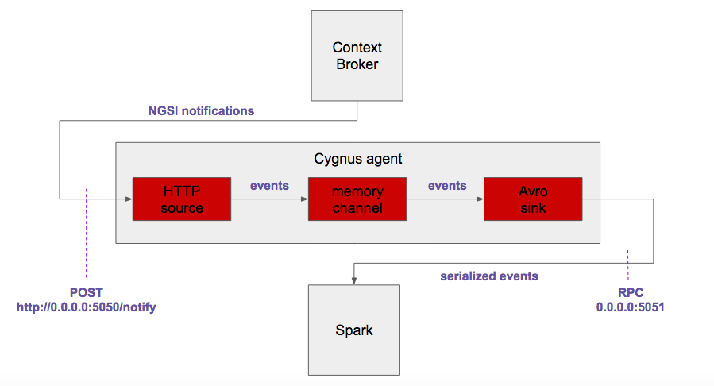

# <a name="top"></a>Connecting Orion Context Broker with Spark Streaming, using Cygnus
Content:

* [Introduction](#section1)
* [Setting up Orion Context Broker](#section2)
* [Setting up Cygnus](#section3)
* [Setting up Spark Streaming](#section4)
* [Testing everything together](#section5)
* [Further information](#section6)

## <a name="section1"></a>Introduction
The idea behind this document is to explain, step-by-step, how to send on change context information in a real time basis from Orion Context Broker to Spark Streaming, for its analysis.

Such a connection will be made thanks to Cygnus, specifically by using the following components:

* Flume's native Http source, listening on TCP/5050 port. 
* Custom NGSI rest handler from Cygnus.
* Flume's native memory channel.
* Flume's native Avro sink, sending Avro binary envents to TCP/5051 port.

The final architecture looks like:



All components installation, configuration and running will be explained according to this document purposes. For the sake of simplicity, all the components will be deployed in a single local machine (even apache Spark, specifically designed for running on top of a cluster, but allowing local mode as well).

[Top](#top)

## <a name="section2"></a>Setting up Orion Context Broker
Orion Context Broker installation guide can be found [here](https://fiware-orion.readthedocs.io/en/master/admin/install/index.html). We recommend to use release 1.6.0 at least.

The default configuarion is OK for this integration example. Simply run it by typing in a shell:

```
$ sudo service contextBroker start
Starting contextBroker...                                    [  OK  ]
```

As usual, a suscription must be made in order Orion Context Broker sends notifications regarding certain context entity updates to Cygnus (typical room1/room entity is used in the example):

```
$ curl -X POST "http://localhost:1026/v2/subscriptions" -s -S -H "Content-Type: application/json" -d @- <<EOF
{
  "subject": {
    "entities": [
      {
        "id": "room1",
        "type": "room"
      }
    ]
  },
  "notification": {
    "http": {
      "url": "http://localhost:5050/notify"
    },
    "attrsFormat": "legacy"
  }
}
EOF
```

Context entities are added to Orion using this other command (typical room1/room entity is used in the example):

```
curl -X POST "http://localhost:1026/v2/entities" -s -S -H 'Content-Type: application/json' -d @- <<EOF
{
  "id": "room1",
  "type": "room",
  "temperature": {
    "value": 26.5,
    "type": "Float"
  }
}
EOF
```

And updated using this other command:

```
curl -X POST "http://localhost:1026/v2/entities/room1/attrs" -s -S -H 'Content-Type: application/json' -d @- <<EOF
{
  "temperature": {
    "value": 27.5,
    "type": "Float"
  }
}
EOF
```

Please refere to Orion Context Broker [official documentation](http://fiware-orion.readthedocs.io/en/latest/) for further details about it.

[Top](#top)

## <a name="section3"></a>Setting up Cygnus
Regarding installation, do it from [FIWARE yum repository](https://github.com/telefonicaid/fiware-cygnus/blob/master/doc/cygnus-ngsi/installation_and_administration_guide/install_with_rpm.md). Once installed in its latest version, a Cygnus agent must be configured as follows:

```
$ cat /usr/cygnus/conf/agent_spark.conf
cygnusagent.sources = http-source
cygnusagent.sinks = avro-sink
cygnusagent.channels = avro-channel

cygnusagent.sources.http-source.type = http
cygnusagent.sources.http-source.channels = avro-channel
cygnusagent.sources.http-source.port = 5050
cygnusagent.sources.http-source.handler = com.telefonica.iot.cygnus.handlers.NGSIRestHandler
cygnusagent.sources.http-source.handler.notification_target = /notify
cygnusagent.sources.http-source.handler.default_service = default
cygnusagent.sources.http-source.handler.default_service_path = /

cygnusagent.sinks.avro-sink.type = avro
cygnusagent.sinks.avro-sink.channel = avro-channel
cygnusagent.sinks.avro-sink.hostname = 0.0.0.0
cygnusagent.sinks.avro-sink.port = 5051

cygnusagent.channels.avro-channel.type = memory
cygnusagent.channels.avro-channel.capacity = 1000
cygnusagent.channels.avro-channel.transactionCapacity = 100
```

A Cygnus instance configuration file must be added too, somethinkg like:

```
$ cat /usr/cygnus/conf/cygnus_instance_spark.conf
CYGNUS_USER=cygnus
CONFIG_FOLDER=/usr/cygnus/conf
CONFIG_FILE=/usr/cygnus/conf/agent_spark.conf
AGENT_NAME=cygnus-ngsi
LOGFILE_NAME=cygnus.log
ADMIN_PORT=5080
POLLING_INTERVAL=30
```

Then, it can be starte as a service:

```
$ sudo service cygnus start
Starting Cygnus spark...                                    [  OK  ]
```

In order to test the integracion among Orion Context Broker and Cygnus, simply update any context entity and check the related notification reception in Cygnus logs:

```
$ tail -f /var/log/cygnus/cygnus.log
...
time=2017-01-27T13:33:28.236UTC | lvl=INFO | corr=a72db6ff-ce15-4d38-a3a3-95af2ecc73b8 | trans=a72db6ff-ce15-4d38-a3a3-95af2ecc73b8 | srv=sc_valencia | subsrv=/gardens | comp=cygnus-ngsi | op=getEvents | msg=com.telefonica.iot.cygnus.handlers.NGSIRestHandler[304] : [NGSIRestHandler] Received data ({  "subscriptionId" : "51c0ac9ed714fb3b37d7d5a8",  "originator" : "localhost",  "contextResponses" : [    {      "contextElement" : {        "attributes" : [          {            "name" : "temperature",            "type" : "centigrade",            "value" : 26.5          }        ],        "type" : "room",        "isPattern" : "false",        "id" : "room1"      },      "statusCode" : {        "code" : "200",        "reasonPhrase" : "OK"      }    }  ]})
...
```

At this moment of the integration most probably you'll see several Java exceptions about the inhability to connect to Spark. That's normal, since Spark listener on TCP/5051 port is not running yet.

[Top](#top)

## <a name="section4"></a>Setting up spark Streaming
Apache Spark will be installed from the URL resulting from entering at [Spark Download page](http://spark.apache.org/downloads.html) and selecting:

* Spark release: 1.6.3
* Package type: pre-built for Hadoop 2.3
* Download type: direct download

The URL the "download Spark" link points to must be copied and then downloaded in our machine (into our home dir, for instance) by doing (Please, replace `d3kbcqa49mib13.cloudfront.net` with the actual base URL in your case):

```
$ cd ~
$ wget http://d3kbcqa49mib13.cloudfront.net/spark-1.6.3-bin-hadoop2.3.tgz
--2017-01-18 14:40:31--  http://d3kbcqa49mib13.cloudfront.net/spark-1.6.3-bin-hadoop2.3.tgz
Resolviendo d3kbcqa49mib13.cloudfront.net (d3kbcqa49mib13.cloudfront.net)... 54.240.186.114, 54.240.186.149, 54.240.186.159, ...
Conectando con d3kbcqa49mib13.cloudfront.net (d3kbcqa49mib13.cloudfront.net)[54.240.186.114]:80... conectado.
Petición HTTP enviada, esperando respuesta... 200 OK
Longitud: 273211089 (261M) [application/x-tar]
Grabando a: “spark-1.6.3-bin-hadoop2.3.tgz”

100%[===========================================================================================================================================>] 273.211.089 30,8MB/s   en 9,6s   

2017-01-18 14:40:40 (27,3 MB/s) - “spark-1.6.3-bin-hadoop2.3.tgz” guardado [273211089/273211089]
```

The downloaded file must be uncompressed and the removed:

```
$ tar xzf spark-1.6.3-bin-hadoop2.3.tgz
$ rm spark-1.6.3-bin-hadoop2.3.tgz
```

Now, Spark should be available under our home dir, thus let's change directory:

```
$ cd spark-1.6.3-bin-hadoop2.3
```

[Top](#top)

## <a name="section5"></a>Testing everything together
In order to test the whole architecture of our real time context information analysis we'll use an already developed analysis application Spark provides within its examples, called `JavaFlumeEventCount`:

```
$ ls examples/src/main/java/org/apache/spark/examples/streaming/ | grep JavaFlumeEventCount.java
JavaFlumeEventCount.java
```

`JavaFlumeEventCount` simply counts the number of Avro events received at the configured port. We'll run such an application by using Spark's `run-example` script:

```
$ ./bin/run-example streaming.JavaFlumeEventCount 0.0.0.0 5051
Using Spark's default log4j profile: org/apache/spark/log4j-defaults.properties
17/01/18 14:46:26 INFO StreamingExamples: Setting log level to [WARN] for streaming example. To override add a custom log4j.properties to the classpath.
17/01/18 14:46:26 WARN NativeCodeLoader: Unable to load native-hadoop library for your platform... using builtin-java classes where applicable
-------------------------------------------
Time: 1484750792000 ms
-------------------------------------------
Received 0 flume events.
```

As can be seen, no Avro events are read. Neverhteless, if we update some context entity among the subscribed ones, we'll see the application receives it (it should take a few seconds for the first time):

```
-------------------------------------------
Time: 1484750800000 ms
-------------------------------------------
Received 1 flume events.
```

[Top](#top)

## <a name="section6"></a>Further information
From here on, the user should create his/her own analytics for Spark Streaming, based on the binary Avro events containing NGSI context information.

It is highly recommended using the NGSI-specific functions for Spark bundled as a library in the [FIWARE Cosmos](https://github.com/telefonicaid/fiware-cosmos/tree/master/cosmos-spark-library) repository. Such a library contains primitives for deserializing binary Avro events, using tuples adapted to the context entity model, and so on. And will help for sure any FIWARE developer, simplifying the design of NGSI-like analytics on top of Spark.

[Top](#top)
