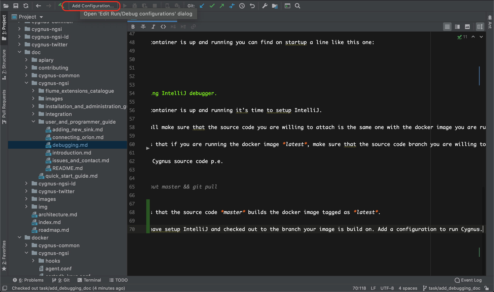
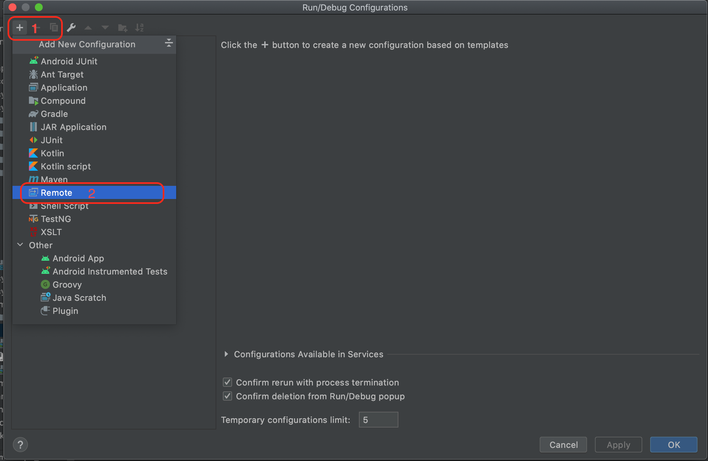
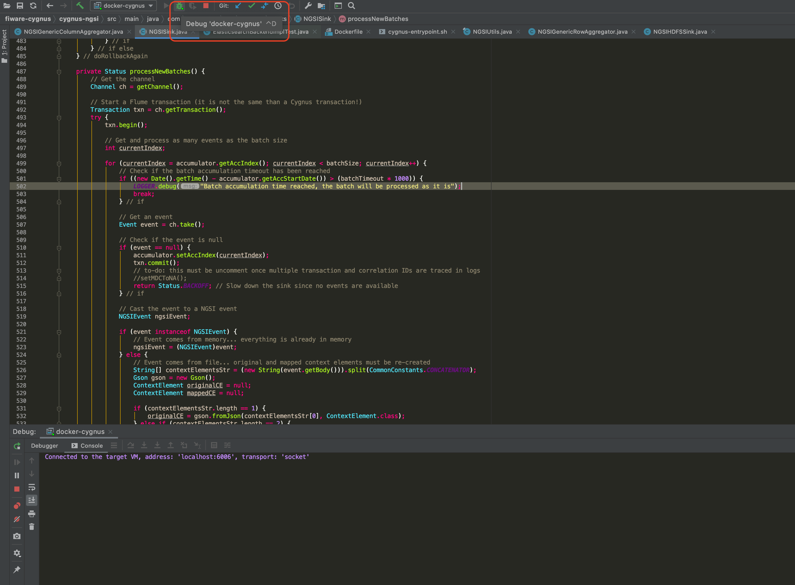

# Debugging Cygnus with Docker and IntelliJ

First of all is important to remember that Cygnus is an artifact which runs into Apache flume. Considering that, it's possible to debug through several ways Cygnus (on this repo you can find information of how to install Cygnus with Apache Flume locally).

This document will guide you to run cygnus on a docker container and attach an external debugger with IntelliJ.

## Cygnus container

First of all you have to pull the docker image you want to debug.

```
docker image pull telefonicaiot/fiware-cygnus:latest
```

Then. It's necessary to deploy a Cygnus container. Take this example.

```
cygnus:
  container_name: cygnus
  hostname: cygnus
  image: telefonicaiot/fiware-cygnus:latest
  ports:
    - "6006:6006"
    - "5050:5050"
  volumes:
    - ${CYGNUS_CONF}/agent.conf:/opt/apache-flume/conf/agent.conf
  environment:
    - CYGNUS_JAVA_OPTS=-agentlib:jdwp=transport=dt_socket,server=y,suspend=n,address=*:6006
    - CYGNUS_SKIP_CONF_GENERATION=true
  log_driver: json-file
  log_opt:
    max-size: "250m"
```

There are a couple of highlights on this compose file.

- There are two exposed ports. 
    - 5050 Example Sink.
    - 6006 Depuration port.
    
- Java Options (for java 8 wich the docker container runs). [More info.](https://docs.oracle.com/javase/7/docs/technotes/guides/jpda/conninv.html)
    - -Xdebug  This flag enables Java debugging.
    - transport=dt_socket  means the way used to connect to JVM (socket is a good choice, it can be used to debug a distant computer)
    - server  once the debugger application connects, it can send a JDWP command to resume the VM
    - suspend  starts execution right away, tell the JVM not to wait until debugger is attached to begin execution
    - address=6006  TCP/IP port exposed, to connect from the debugger    
    
Once the container is up and running you should find on startup a line like this one:

```
Warning: JAVA_HOME is not set!
+ exec /usr/bin/java -Xmx64m -Xms64m -Xdebug -Xrunjdwp:transport=dt_socket,server=y,suspend=n,address=6006 -Dflume.root.logger=INFO,LOGFILE -Duser.timezone=UTC -Dfile.encoding=UTF-8 -cp '/opt/apache-flume/conf:/opt/apache-flume/lib/*:/opt/apache-flume/plugins.d/cygnus/lib/*:/opt/apache-flume/plugins.d/cygnus/libext/*' -Djava.library.path= com.telefonica.iot.cygnus.nodes.CygnusApplication -f /opt/apache-flume/conf/agent.conf -n cygnus-ngsi -p 5080
Listening for transport dt_socket at address: 6006
```

## Attaching java jdb debugger and set a breakpoint 
```
 jdb -attach 127.0.0.1:6006
```
```
Set uncaught java.lang.Throwable
Set deferred uncaught java.lang.Throwable
Initializing jdb ...
> stop in com.telefonica.iot.cygnus.sinks.NGSIArcgisFeatureTableSink.getPersistenceBackend
Set breakpoint com.telefonica.iot.cygnus.sinks.NGSIArcgisFeatureTableSink.getPersistenceBackend
> run
Nothing suspended.
```

## Attaching IntelliJ debugger.

Once the container is up and running it's time to setup IntelliJ.

First of all make sure that the source code you are willing to attach is the same one with the docker image you are running.

This means that if you are running the docker image *latest*, make sure that the source code branch you are willing to debug is *master*.

To update Cygnus source code p.e.

```
git checkout master && git pull
```

This means that the source code *master* builds the docker image tagged as *latest*.

Once you have setup IntelliJ and checked out to the branch your image is build on. Add a configuration to run Cygnus.



Add a remote Configuration from templates.



Setup the exposed port from the container.


When the configuration is ready, you just have to debug Cygnus as Usuall.



When de debugger is attached you will see the output:

```
Connected to the target VM, address: 'localhost:6006', transport: 'socket'
```

This means the IntelliJ debugger attached successfully to the container.
